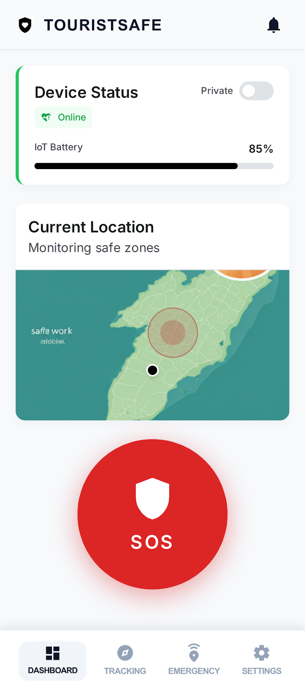
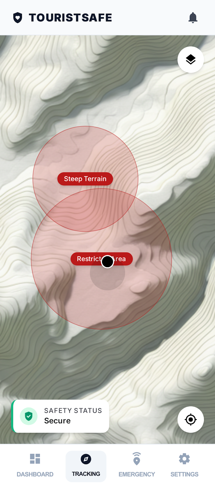
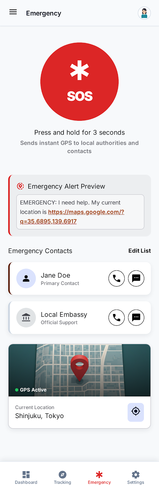
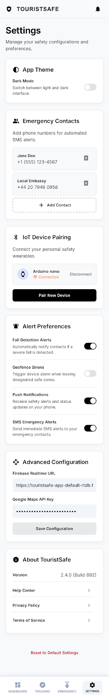

# TouristSafe - Smart Tourist Safety & Tracking System

[](LICENSE)
[](https://flutter.dev/)
[](https://firebase.google.com/)
[](CONTRIBUTING.md)

A comprehensive Flutter mobile app combined with IoT hardware for real-time tourist safety. The app uses live location tracking, geofencing alerts, emergency SOS, and Firebase-backed device monitoring to keep tourists secure.

## Table of Contents

- [Overview](#overview)
- [Features](#features)
- [Technical Stack](#technical-stack)
- [Current Requirements](#current-requirements)
- [Current Progress/Status](#current-progressstatus)
- [Project Structure](#project-structure)
- [Installation](#installation)
- [Usage](#usage)
- [API & Integrations](#api--integrations)
- [Contributing](#contributing)
- [Roadmap](#roadmap)
- [License](#license)
- [Screenshots](#screenshots)

## Overview

This repository contains the TouristSafe app, a product focused on improving tourist safety through a mobile app and IoT device integration. It is designed to be fully cross-platform with Flutter, supported by Firebase services, and connected to ESP32-based hardware for real-time sensor data.

## Features

### Core MVP

- Real-time Google Maps location tracking
- Firebase Realtime Database sync for IoT device data
- SOS button with emergency SMS routing
- Geofencing danger alerts with map visualization
- Device online/offline status and battery monitoring
- Privacy mode toggle
- Emergency contact management

### Should-Have

- Fall detection notifications
- Push notifications for alerts
- Battery level display

### Nice-to-Have

- History of alerts
- Safe zone routing
- Multi-language support
- Admin dashboard

## Technical Stack

| Area | Technology | Purpose |
|------|------------|---------|
| Mobile | Flutter | Cross-platform app development |
| Maps | Google Maps Flutter | Interactive map display |
| Location | geolocator | GPS and location tracking |
| Permissions | permission_handler | Manage location and SMS permissions |
| Notifications | flutter_local_notifications | Local alert notifications |
| SMS | flutter_sms | Send emergency SMS messages |
| Backend | Firebase Realtime Database | Real-time data sync |
| Auth | Firebase Authentication | User login and session management |
| Push | Firebase Cloud Messaging | Push alert delivery |
| Hardware | ESP32 / Arduino | IoT data acquisition |

## Current requirements

The current requirements of TouristSafe are to create a minimum viable product that proves a real-time safety workflow: live location tracking, geofence warnings, emergency SOS, and IoT device monitoring all connected through Firebase.

## Current Progress/status

- Product requirements and technical stack documented
- Wireframes completed for dashboard, map, emergency, and settings
- Firebase architecture and integration plan defined
- Initial Flutter folder structure and feature layout drafted
- SMS, geofencing, Google Maps, and IoT integration identified as core areas

If you want, I can also merge this directly into README.md and update the table of contents.

## Project Structure

```
lib/
├── main.dart                          # App entry point
├── core/
│   ├── constants/                     # App constants and themes
│   ├── themes/                        # Theme and text styles
│   └── utils/                         # Helper utilities
├── services/                          # Firebase, location, SMS, notifications
├── models/                            # Data models (device, location, geofence)
├── providers/                         # State management providers
├── screens/                           # App screens (dashboard, map, emergency, settings)
├── widgets/                           # Reusable UI components
├── config/                            # Firebase and API configuration
└── assets/                            # Images and wireframes
Resources/
├── Tourist_safety_app.md              # Product requirements document
├── Wireframing_doc.md                 # Wireframe specifications
└── smart_tourist_safety_system/       # Wireframe HTML and screenshot files
```

## Installation

### Prerequisites

- Flutter SDK installed
- Android Studio or VS Code with Flutter extensions
- Firebase account
- ESP32 hardware for IoT integration (optional for app development)

### Setup

1. Clone the repository:
   ```bash
   git clone https://github.com/yourusername/tourist-safety-app.git
   cd tourist-safety-app
   ```

2. Install Flutter packages:
   ```bash
   flutter pub get
   ```

3. Configure Firebase:
   - Create a Firebase project.
   - Enable Realtime Database, Authentication, and Cloud Messaging.
   - Add `google-services.json` to `android/app/`.
   - Add `GoogleService-Info.plist` to `ios/Runner/`.

4. Configure API keys:
   - Add Google Maps API key using `lib/config/api_keys.dart`.

5. Run the app:
   ```bash
   flutter run
   ```

## Usage

- Open the app on a connected device or emulator.
- Grant location and SMS permissions.
- Connect or simulate IoT device data from Firebase.
- Use the dashboard to monitor status, battery, and location.
- Press the SOS button in case of emergency.

## API & Integrations

This project uses:

- Firebase Realtime Database for data storage and live sync.
- Firebase Authentication for user login.
- Google Maps API for map rendering and geofence visualization.
- Flutter SMS for emergency messaging.
- Firebase Cloud Messaging for push alerts.

See `Resources/Tourist_safety_app.md` for full integration details.

## Contributing

Thank you for your interest in contributing!

### How to contribute

1. Fork the repository.
2. Create a branch: `git checkout -b feature/your-feature`.
3. Make your changes and test thoroughly.
4. Submit a pull request with a clear summary.

### Contribution priorities

- Improve wireframes and UI components.
- Add tests and quality checks.
- Enhance Firebase and device integration.
- Improve documentation and setup guidance.

### Contributor resources

- `Resources/Tourist_safety_app.md` for product requirements.
- `Resources/Wireframing_doc.md` for screen design details.

## Roadmap

- MVP: Live tracking, geofencing, SOS, Firebase sync.
- Next: Push notifications, battery alerts, offline behavior.
- Future: Multi-language, alert history, admin dashboard.

## License

This repository is licensed under the MIT License. See [LICENSE](LICENSE) for details.

## Screenshots

### Dashboard Screen
[](Resources/smart_tourist_safety_system/home_dashboard/screen.png)

### Tracking Map Screen
[](Resources/smart_tourist_safety_system/detailed_tracking_map/screen.png)

### Emergency Screen
[](Resources/smart_tourist_safety_system/emergency_tab/screen.png)

### Settings Screen
[](Resources/smart_tourist_safety_system/settings_configuration/screen.png)


---

