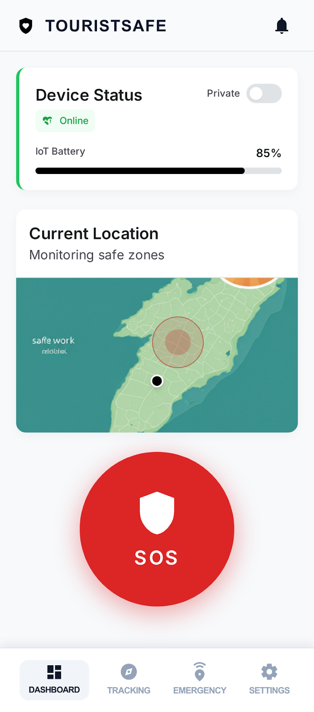
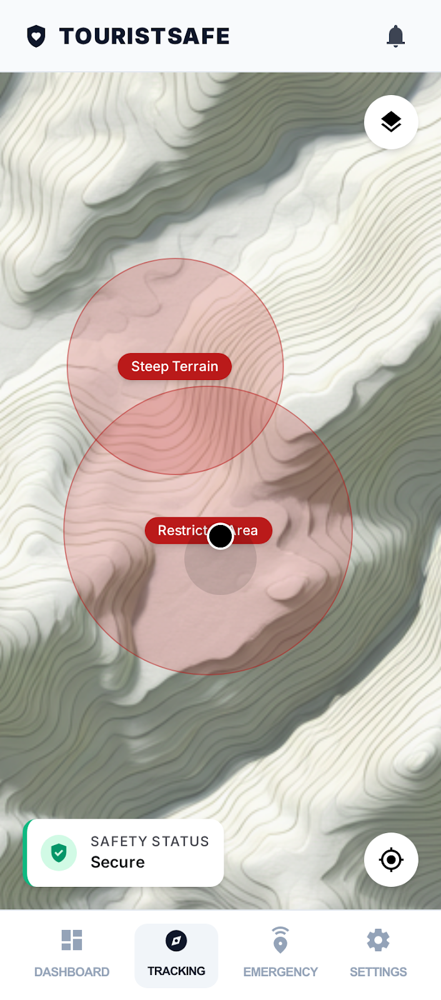
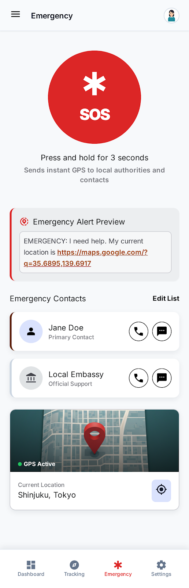
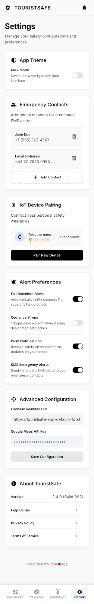

# TouristSafe - Smart Tourist Safety & Tracking System

A comprehensive Flutter mobile app for real-time tourist safety. The app uses live location tracking, geofencing alerts, emergency SOS, and local persistence to keep tourists secure.

## Table of Contents

- [Overview](#overview)
- [Features](#features)
- [Technical Stack](#technical-stack)
- [Current Status](#current-status)
- [Resource Links](#resource-links)
- [Usage & Getting Started](#usage--getting-started)
- [System Architecture & Integrations](#system-architecture--integrations)
- [License](#license)
- [Screenshots](#screenshots)

## Overview

TouristSafe is a mobile application focused on high-reliability tourist safety. Built natively using Flutter, the platform bypasses complex server architectures where possible to manage critical emergency pipelines directly on-device using local persistence, hardware sensors, and direct SMS fallback protocols.

## Features

### Production Core Features
* **Real-time Maps & Geofencing:** Interactive map visualization utilizing OpenStreetMap and Overpass API to dynamically fetch and alert users of safe/danger zones.
* **Automated Fall Detection:** Monitors device telemetry via the accelerometer to automatically identify accidental falls.
* **System Monitor Dashboard:** A comprehensive diagnostic view tracking background service stability, API availability, and location stream health.
* **Persistent Background Service:** Continuous, low-latency location tracking operating independently of the app's foreground state.
* **Emergency SOS Hub:** Instantly route pre-configured SOS distress messages containing live coordinates using direct SMS fallback routing.
* **Emergency Contact Management:** Local database tool to add, prioritize, and manage trusted safety contacts.
* **Privacy Control:** Explicit privacy toggle to pause, mask, or resume tracking streams at the user's discretion.
* **Alert History Log:** Full historical tracking of past geofence breach notifications and triggers.

## Technical Stack

| Area | Technology / Sensor | Purpose |
| :--- | :--- | :--- |
| **Mobile Framework** | Flutter | Cross-platform production client development |
| **Maps & Spatial** | OpenStreetMap / Overpass API | Map rendering & dynamic zone queries |
| **Location Tracking** | Geolocator / Background Services | Persistent background/foreground GPS streaming |
| **Telemetry** | Accelerometer (Hardware) | Crash and fall detection algorithms |
| **Permissions** | permission_handler | Granular access rules for Location, Background, and SMS |
| **Alerting** | flutter_local_notifications | Instant push-style danger alerts & status updates |
| **Emergency Fallback**| flutter_sms | SMS dispatch protocol bypassing internet failure |
| **Local Cache** | shared_preferences / Secure Storage | Local state retention, contact registers, and logs |

## Current Status

The core Minimum Viable Product (MVP) phase is **Complete**. TouristSafe has evolved into a production-grade application featuring mature background tracking architectures, live hardware sensor streams, and dynamic geofencing pipelines.

## Resource Links

- [Product Requirements Document](Resources/Tourist_safety_app.md)
- [Wireframing Specifications](Resources/Wireframing_doc.md)
- [Wireframe Assets and Screenshots](Resources/smart_tourist_safety_system/)
- [License](LICENSE)
- [Planning Document](Resources/planing.md)

## Usage & Getting Started

To ensure the application functions reliably in critical scenarios, follow these setup stages carefully:

### 1. Installation
* Navigate to the **Releases** section of this repository.
* Download and install the latest compiled production binary (`.apk` for Android).

### 2. Permissions & Consent
* Upon the initial launch, review and accept the privacy data policies.
* Grant **Location Permissions** (ensure you choose **"Allow all the time"** to enable background security features).
* Grant **SMS Permissions** to allow the emergency routing systems to send texts when offline.

### 3. Device Configurations
* Ensure your device's global **GPS / Location Services** toggle is explicitly turned ON.
* Exclude TouristSafe from any aggressive system battery optimization scripts to prevent background service termination.

### 4. Mandatory Safety Prep
* **Add Emergency Contacts:** Before initializing your journey, navigate to the Contacts tab and save your emergency contacts. The SOS system will not initiate without an active contact list.
* **Synchronize Zones:** Allow the application a brief moment to stabilize on a network connection. It will ping the Overpass API to pull localized safe and danger zones relative to your current coordinates.

---

## System Architecture & Integrations

The system avoids central server reliance to maximize availability in remote regions:
* **Overpass API Integration:** Queries regional boundary metadata for real-time safety zoning logic.
* **Hardware Telemetry Stream:** Actively polls the device's onboard accelerometer to capture sudden deceleration spikes indicative of accidental falls.
* **Local Data Vault:** Critical user configurations, safety logs, and emergency vectors are kept encrypted locally on-device.

## License

This repository is licensed under the MIT License. See [LICENSE](LICENSE) for details.

## Screenshots

### Dashboard Screen

### Tracking Map Screen

### Emergency Screen

### Settings Screen

---
